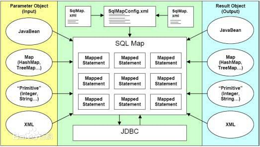
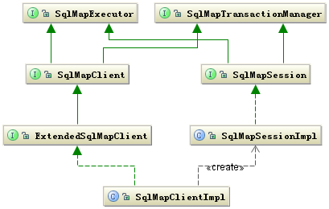
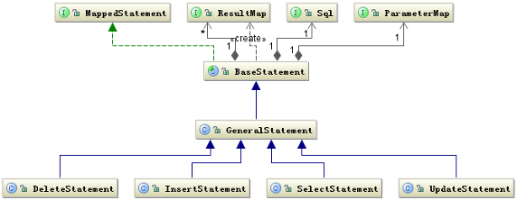
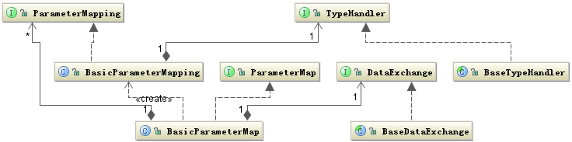
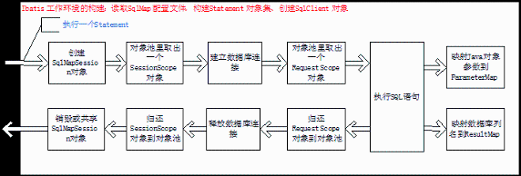
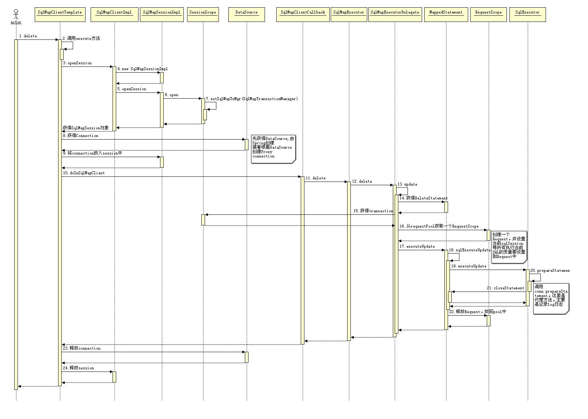
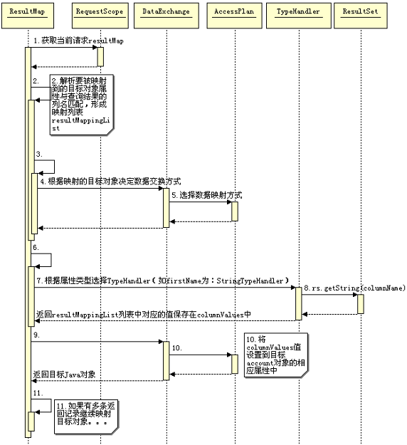
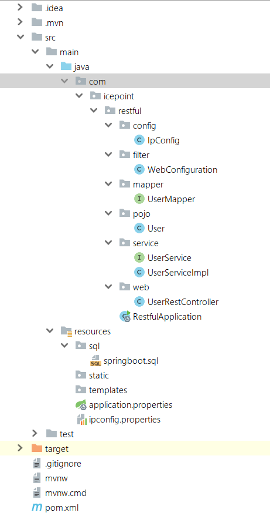

# SpringBoot+iBatis实现restful页面

### 1.iBatis (MyBatis)框架

> MyBatis 本是apache的一个开源项目iBatis, 2010年这个项目由apache software foundation 迁移到了google code，并且改名为MyBatis 。
>
> iBATIS一词来源于“internet”和“abatis”的组合，是一个基于Java的持久层框架。
>
> iBATIS提供的持久层框架包括SQL Maps和Data Access Objects（DAO）。

iBatis(MyBatis) 是支持普通 SQL查询，[存储过程](https://baike.baidu.com/item/%E5%AD%98%E5%82%A8%E8%BF%87%E7%A8%8B)和高级映射的优秀[持久层](https://baike.baidu.com/item/%E6%8C%81%E4%B9%85%E5%B1%82)框架。iBatis(MyBatis) 消除了几乎所有的[JDBC](https://baike.baidu.com/item/JDBC)代码和参数的手工设置以及[结果集](https://baike.baidu.com/item/%E7%BB%93%E6%9E%9C%E9%9B%86)的检索。MyBatis 使用简单的 XML或注解用于配置和原始映射，将接口和 Java 的POJOs（Plain Ordinary Java Objects，普通的 Java对象）映射成数据库中的记录。

iBatis架构：



**iBatis工作原理**

iBATIS 通过 SQL Map 将 Java 对象映射成 SQL 语句和将结果集再转化成 Java 对象，与其他 ORM 框架相比，既解决了 Java 对象与输入参数和结果集的映射，又能够让用户方便的手写使用 SQL 语句。

总体来说 iBATIS 的系统结构还是比较简单的，它主要完成两件事情：

1. 根据 JDBC 规范建立与数据库的连接；
2. 通过反射打通 Java 对象与数据库参数交互之间相互转化关系。

iBATIS 的框架结构也是按照这种思想来组织类层次结构的，其实它是一种典型的交互式框架。先期准备好交互的必要条件，然后构建一个交互的环境，交互环境中还划分成会话，每次的会话也有一个环境。当这些环境都准备好了以后，剩下的就是交换数据了。其实涉及到网络通信，一般都会是类似的处理方式。



上面的类图中左边 SqlMapClient 接口主要定义了客户端的操作行为包括 select、insert、update、delete。而右边主要是定义了当前客户端在当前线程的执行环境。SqlMapSession 可以共享使用，也可以自己创建，如果是自己创建在结束时必须要调用关闭接口关闭。

当使用者持有了 SqlMapClientImpl 对象就可以使用 iBATIS 来工作了。这里还要提到另外一个类 SqlMapExecutorDelegate 这个类从名字就可以看出他是执行代理类。这个类非常重要，重要是因为他耦合了用户端的执行操作行为和执行的环境，他持有执行操作的所需要的数据，同时提供管理着执行操作依赖的环境。所以他是一个强耦合的类，也可以看做是个工具类。

**iBATIS 框架的设计策略**

iBATIS 主要的设计目的还是为了让我们执行 SQL 时对输入输出的数据管理更加方便。

iBATIS 框架的一个重要组成部分就是其 SqlMap 配置文件，SqlMap 配置文件的核心是 Statement 语句包括 CIUD。 iBATIS 通过解析 SqlMap 配置文件得到所有的 Statement 执行语句，同时会形成 ParameterMap、ResultMap 两个对象用于处理参数和经过解析后交给数据库处理的 Sql 对象。

这样除去数据库的连接，一条 SQL 的执行条件已经具备了（数据库连接可以自己去写）。

**statement**有关的类结构类：



**参数映射** (SQL 语句中的参数与 Java 对象之间的关系)相关的类结构图：



**iBATIS 框架的运行原理**

主要执行步骤



iBATIS 对管理事务既可以自己管理也可以由外部管理，iBATIS 自己管理是通过共享 SqlMapSession 对象实现的，多个 Statement 的执行时共享一个 SqlMapSession 实例，而且都是线程安全的。如果是外部程序管理就要自己控制 SqlMapSession 对象的生命周期。

通过 Spring 调用 iBATIS 执行一个 Statement 的一个详细的时序图：



( [清晰版本](http://www.ibm.com/developerworks/cn/java/j-lo-ibatis-principle/origin_image005.jpg) )

##### 映射返回对象时序图




###2.项目示例（Springboot+ibatis实现restful风格的用户增删改查系统）

**项目启动**：

```shell
$ git clone https://github.com/icepoint666/SpringbootRestful.git
```

直接打开IDEA -> Open Project -> 选择项目根目录下的restful目录 -> 编译运行

**项目目录：**



**项目构建：**

通过maven配置pom.xml

```xml
<?xml version="1.0" encoding="UTF-8"?>
<project xmlns="http://maven.apache.org/POM/4.0.0" xmlns:xsi="http://www.w3.org/2001/XMLSchema-instance"
	xsi:schemaLocation="http://maven.apache.org/POM/4.0.0 http://maven.apache.org/xsd/maven-4.0.0.xsd">
	<modelVersion>4.0.0</modelVersion>

	<groupId>com.icepoint</groupId>
	<artifactId>restful</artifactId>
	<version>0.0.1-SNAPSHOT</version>
	<packaging>jar</packaging>

	<name>restful</name>
	<description>Restful project for Spring Boot</description>

	<parent>
		<groupId>org.springframework.boot</groupId>
		<artifactId>spring-boot-starter-parent</artifactId>
		<version>2.0.1.RELEASE</version>
		<relativePath/> <!-- lookup parent from repository -->
	</parent>

	<properties>
		<project.build.sourceEncoding>UTF-8</project.build.sourceEncoding>
		<project.reporting.outputEncoding>UTF-8</project.reporting.outputEncoding>
		<java.version>1.8</java.version>
	</properties>


	<dependencies>
		<dependency>
			<groupId>org.springframework.boot</groupId>
			<artifactId>spring-boot-starter-web</artifactId>
		</dependency>
		<dependency>
			<groupId>org.springframework.boot</groupId>
			<artifactId>spring-boot-starter-test</artifactId>
			<scope>test</scope>
		</dependency>
		<!-- Spring Boot Mybatis 依赖 -->
		<dependency>
			<groupId>org.mybatis.spring.boot</groupId>
			<artifactId>mybatis-spring-boot-starter</artifactId>
			<version>1.1.1</version>
		</dependency>

		<dependency>
			<groupId>org.springframework.boot</groupId>
			<artifactId>spring-boot-configuration-processor</artifactId>
			<optional>true</optional>
		</dependency>
		<!-- https://mvnrepository.com/artifact/org.apache.ibatis/ibatis-core -->
		<dependency>
			<groupId>mysql</groupId>
			<artifactId>mysql-connector-java</artifactId>
		</dependency>
	</dependencies>

	<build>
		<plugins>
			<plugin>
				<groupId>org.springframework.boot</groupId>
				<artifactId>spring-boot-maven-plugin</artifactId>
			</plugin>
		</plugins>
	</build>


</project>

```

运行前先要在mysql，执行sql文件

存放在resources/sql/sprintboot.sql

```sql
//springboot.sql
CREATE DATABASE `springboot`;

USE `springboot`;

/*Table structure for table `t_user` */

DROP TABLE IF EXISTS `t_user`;

CREATE TABLE `t_user` (
  `id` int(11) NOT NULL AUTO_INCREMENT COMMENT 'id',
  `name` varchar(10) DEFAULT NULL COMMENT '姓名',
  `age` int(2) DEFAULT NULL COMMENT '年龄',
  PRIMARY KEY (`id`)
) ENGINE=InnoDB AUTO_INCREMENT=12 DEFAULT CHARSET=utf8;
```

在mysql执行文件

```shell
$ mysql> source resources\sql\springboot.sql
```


**项目代码：**

**User.java**定义在pojo包里，表示Plain Ordinary Java Objects普通的Java对象

```java
// User.java
package com.icepoint.restful.pojo;

public class User {

    private int id;
    private String name;
    private int age;

    public User(){
    }
    /**
     * @param id
     * @param name
     */
    public User(int id, String name) {
        super();
        this.id = id;
        this.name = name;
    }

    /**
     * @return id
     */
    public int getId() {
        return id;
    }

    /**
     * @param id
     */
    public void setId(int id) {
        this.id = id;
    }

    /**
     * @return name
     */
    public String getName() {
        return name;
    }

    /**
     * @param name
     */
    public void setName(String name) {
        this.name = name;
    }
    /**
     * @return  age
     */
    public int getAge() {
        return age;
    }
    /**
     * @param age
     */
    public void setAge(int age) {
        this.age = age;
    }
}
```

**UserService.java**定义在service包内定义一个用户增删改查服务的接口

```java
// UserService.java
package com.icepoint.restful.service;

import java.util.List;

import com.icepoint.restful.pojo.User;

public interface UserService {
    /**
     * @param user
     * @return
     */
    boolean addUser(User user);
    /**
     * @param user
     * @return
     */
    boolean updateUser(User user);
    /**
     * @param id
     * @return
     */
    boolean deleteUser(int id);
    /**
     * @param userName
     */
    User findUserByName(String userName);
    /**
     * @return
     */
    List<User> findAll();
}

```

**UserServiceImpl.java**定义在service.impl包里，用于实现定义在接口的功能，通过Dao来实现

`@Autowired`

其实在启动spring IoC时，容器自动装载了一个AutowiredAnnotationBeanPostProcessor后置处理器，当容器扫描到@Autowied、@Resource或@Inject时，就会在IoC容器自动查找需要的bean，并装配给该对象的属性

在使用@Autowired时，首先在容器中查询对应类型的bean：

- 如果查询结果刚好为一个，就将该bean装配给@Autowired指定的数据
- 如果查询的结果不止一个，那么@Autowired会根据名称来查找。
- 如果查询的结果为空，那么会抛出异常。解决方法时，使用required=false

介绍一下注解：

`@Service`用于标注业务层组件

`@Controller`用于标注控制层组件（如struts中的action）

`@Repository`用于标注数据访问组件，即DAO组件

`@Component`泛指组件，当组件不好归类的时候，我们可以使用这个注解进行标注。

```java
//UserServiceImpl.java
package com.icepoint.restful.service;

import java.util.List;

import com.icepoint.restful.mapper.UserMapper;
import org.springframework.beans.factory.annotation.Autowired;
import org.springframework.stereotype.Service;

import com.icepoint.restful.pojo.User;

@Service(value = "UserService")
public class UserServiceImpl implements UserService{

    @Autowired
    private UserMapper userMapper;

    @Override
    public boolean addUser(User user){
        boolean flag = false;
        try{
            userMapper.addUser(user);
            flag = true;
        }catch(Exception e){
            System.out.println("Add Failed!");
            e.printStackTrace();
        }
        return flag;
    }

    @Override
    public boolean updateUser(User user){
        boolean flag = false;
        try{
            userMapper.updateUser(user);
            flag = true;
        }catch(Exception e){
            System.out.println("Update Failed!");
            e.printStackTrace();
        }
        return flag;
    }

    @Override
    public boolean deleteUser(int id){
        boolean flag = false;
        try{
            userMapper.deleteUser(id);
            flag = true;
        }catch(Exception e){
            System.out.println("Delete Failed!");
            e.printStackTrace();
        }
        return flag;
    }

    @Override
    public User findUserByName(String userName){
        return userMapper.findByName(userName);
    }

    @Override
    public List<User> findAll(){
        return userMapper.findAll();
    }
}

```

PS: spring boot 中@Autowired注解无法自动注入的错误:

原因：SpringBoot项目的Bean装配默认规则是根据Application类所在的包位置从上往下扫描！“Application类”是指SpringBoot项目入口类。这个类的位置很关键：如果Application类所在的包为：com.boot.app，则只会扫描com.boot.app包及其所有子包，如果service或dao所在包不在com.boot.app及其子包下，则不会被扫描！即把Application类放到dao、service所在包的上级，com.boot.Application知道这一点非常关键

**UserMapper.java**定义在mapper包内，DAO(Data Access Object) [数据访问对象](https://baike.so.com/doc/7572623-7846717.html)是一个[面向对象](https://baike.so.com/doc/6146835-6360018.html)的数据库接口。相当于可以传递参数到sql语句中，具体实现通过上面所介绍的iBatis来实现。

需要导入org.apache.ibatis.annotations包

```java
//UserMapper.java
package com.icepoint.restful.mapper;

import java.util.List;

import org.apache.ibatis.annotations.*;

import com.icepoint.restful.pojo.User;

public interface UserMapper {

    @Insert("insert into t_user(id, name, age) values (#{id}, #{name}, #{age})")
    void addUser(User user);

    @Update("update t_user set name=#{name},age=#{age} where id=#{id}")
    void updateUser(User user);

    @Delete("delete from t_user where id=#{id}")
    void deleteUser(int id);

    @Select("SELECT id,name,age FROM t_user where name=#{userName}")
    User findByName(String userName);

    @Select("SELECT id,name,age FROM t_user")
     List<User> findAll();
}

```

`@Delete`,`@Insert`,`@Select`,`@Update`后面括号里包含mysql语句，表明要执行的操作

```java
@Mapper  
public interface DemoMapper {  
	@Insert("insert into Demo(name) values(#{name})")  
	@Options(keyProperty="id",keyColumn="id",useGeneratedKeys=true)  
	public void save(Demo demo);  
}  
```

**UserRestController.java**定义在web包内主要是一个controller。

作用是将UserService类功能通过restfulAPI来实现。

```java
//UserRestController.java
package com.icepoint.restful.web;

import java.util.List;

import org.springframework.beans.factory.annotation.Autowired;
import org.springframework.web.bind.annotation.RequestBody;
import org.springframework.web.bind.annotation.RequestMapping;
import org.springframework.web.bind.annotation.RequestMethod;
import org.springframework.web.bind.annotation.RequestParam;
import org.springframework.web.bind.annotation.RestController;

import com.icepoint.restful.pojo.User;
import com.icepoint.restful.service.UserService;

@RestController
@RequestMapping(value = "/api")
public class UserRestController {
    @Autowired
    private UserService userService;

    @RequestMapping(value = "/user", method = RequestMethod.POST)
    public boolean addUser(@RequestBody User user){
        System.out.println("Adding...");
        return userService.addUser(user);
    }

    @RequestMapping(value = "/user", method = RequestMethod.PUT)
    public boolean updateUser(@RequestBody User user) {
    	System.out.println("Updating...");
        return userService.updateUser(user);
    }

    @RequestMapping(value = "/user", method = RequestMethod.DELETE)
    public boolean delete(@RequestParam(value = "userId", required = true) int userId) {
        System.out.println("Deleting...");
        return userService.deleteUser(userId);
    }

    @RequestMapping(value = "/user", method = RequestMethod.GET)
    public User findByUserName(@RequestParam(value = "userName", required = true) String userName) {
    	System.out.println("Finding...");
        return userService.findUserByName(userName);
    }

    @RequestMapping(value = "/userAll", method = RequestMethod.GET)
    public List<User> findByUserAge() {
    	System.out.println("Finding All...");
        return userService.findAll();
    }

}
```

**RestfulApplication.java**项目的运行主类，包含main方法

```java
//RestfulApplication.java
package com.icepoint.restful;

import org.mybatis.spring.annotation.MapperScan;
import org.springframework.boot.SpringApplication;
import org.springframework.boot.autoconfigure.SpringBootApplication;
import org.springframework.context.annotation.ComponentScan;

@ComponentScan(basePackages = {"com.icepoint.restful.web", "com.icepoint.restful.service"})
@MapperScan(basePackages = "com.icepoint.restful.mapper")
@SpringBootApplication
public class RestfulApplication {

	public static void main(String[] args) {

		SpringApplication.run(RestfulApplication.class, args);
		System.out.println("Running...");
	}
}

```

扫包注解：

`@ComponentScan` 是用于扫描其他模块中的接口的@Component @Service @Controller 等

`@MapperScan`是用于扫描模块中的Mapper类


**IpConfig.java**定义在config包内，作用设置ip地址的白名单。

IP地址的白名单定义在resources/ipconfig.properties文件里:

```properties
ipconfig:
  ipWhiteList: 127.0.0.1|0:0:0:0:0:0:0:1
```

properties文件：

properties文件都是以键值对的形式存在的，存在的目的是为了转化成Java实体类，以供使用。

一般使用：在java类里可以通过new一个Properties对象并加载使用。

```java
Properties properties = new Properties(); //新建对象
String path = Thread.currentThread().getContextClassLoader().getResource("test.properties").getPath(); //获取文件路径
properties.load(new FileInputStream(path)); //加载该文件
String name = properties.getProperty("name"); //然后就可以得到它的属性
```

但是在Spring框架中不需要那么麻烦：

```java
//IpConfig.java
package com.icepoint.restful.config;

import org.springframework.beans.factory.annotation.Value;
import org.springframework.boot.context.properties.ConfigurationProperties;
import org.springframework.context.annotation.PropertySource;
import org.springframework.stereotype.Component;

@Component
@ConfigurationProperties(prefix = "ipconfig")
@PropertySource(value = "classpath:ipconfig.properties")
public class IpConfig {
    @Value("${ipWhiteList}")
    private String ipWhiteList;

    /**
     * @return ipWhiteList
     */
    public String getIpWhiteList(){
        return ipWhiteList;
    }
}

```

`@Component`

在持久层、业务层和控制层分别采用 @Repository、@Service 和 @Controller 对分层中的类进行注释，而用 @Component 对那些比较中立的类进行注释。这里就是说把这个类交给Spring管理，重新起个名字，由于不好说这个类属于哪个层面，就用@Component.

`@ConfigurationProperties`

作用就是绑定.properties文件中的属性，@ConfigurationProperties(prefix = "ipconfig")满足这个prefix(前缀)的属性都被绑定到这个类上。

`@PropertySource(value = "classpath:config/ipconfig.properties")`

Spring框架提供的PropertySource注解，目的是加载指定的属性文件。上述是加载classpath路径中config文件中的ipconfig.properties文件，value值是设置需要加载的属性文件，可以一次性设置多个。

这里是实现了ConfigurationProperties与PropertySource的配合使用。

前者用于确定属性，后者用于确定properties文件。

`@Value`

简化读取Properties文件中的配置值。两种使用方法：

@Value("#{configProperties['key']}")

@Value("${key}")


**WebConfiguration.java**文件定义在fliter包内

主要功能：

Spring Boot 之FilterRegistrationBean  --支持web Filter 排序的使用

此类提供setOrder方法，可以为filter设置排序值，自定义注入，并支持依赖注入，组件排序 

@Configuration申明这是一个配置类相当于xml配置文件，可理解为用spring的时候xml里面配置的beans标签

@Bean可理解为用spring的时候xml里面配置的bean标签，表示这是一个Spring管理的bean

Spring Boot不是spring的加强版，所以@Configuration和@Bean同样可以用在普通的spring项目中，而不是Spring Boot特有的，只是在spring用的时候，注意加上扫包配置

Filter被定义在内部

```java
//WebConfiguration.java
package com.icepoint.restful.filter;

import java.io.IOException;
import java.util.Arrays;
import java.util.HashMap;
import java.util.List;
import java.util.Map;

import javax.servlet.Filter;
import javax.servlet.FilterChain;
import javax.servlet.FilterConfig;
import javax.servlet.ServletException;
import javax.servlet.ServletRequest;
import javax.servlet.ServletResponse;
import javax.servlet.http.HttpServletRequest;
import javax.servlet.http.HttpServletResponse;

import org.springframework.beans.factory.annotation.Autowired;
import org.springframework.boot.web.servlet.FilterRegistrationBean;
import org.springframework.context.annotation.Bean;
import org.springframework.context.annotation.Configuration;

import com.fasterxml.jackson.databind.ObjectMapper;
import com.icepoint.restful.config.IpConfig;


@Configuration
public class WebConfiguration {

    @Autowired
    private IpConfig ipconfig;

    @Bean
    public FilterRegistrationBean testFilterRegistration() {
        FilterRegistrationBean registration = new FilterRegistrationBean();
        registration.setFilter(new MyFilter());
        //过滤掉 /getUser 和/hello 的请求
        //registration.addUrlPatterns("/getUser","/hello");
        //过滤掉所有请求
        //registration.addUrlPatterns("/*");
        registration.addInitParameter("paramName", "paramValue");
        registration.setName("MyFilter");
        registration.setOrder(1);
        return registration;
    }


    class MyFilter implements Filter {
        @Override
        public void doFilter(ServletRequest srequest, ServletResponse sresponse, FilterChain filterChain)
                throws IOException, ServletException {
            HttpServletRequest request = (HttpServletRequest) srequest;
            HttpServletResponse response = (HttpServletResponse) sresponse;
            //执行过滤操作...
            System.out.println("请求的url :"+request.getRequestURI());
            //检查是否是白名单的IP
            if(!checkIP(request,response)){
                return;
            }
            filterChain.doFilter(srequest, sresponse);
        }

        @Override
        public void init(FilterConfig filterConfig) throws ServletException {
            System.out.println("参数初始化:"+filterConfig);
        }

        @Override
        public void destroy() {
            System.out.println("开始销毁...");
        }
    }

    private boolean checkIP(HttpServletRequest request,HttpServletResponse response){
        String ip = getIpAddr(request);
        //获取可以访问系统的白名单
        String ipStr = ipconfig.getIpWhiteList();
        String[] ipArr = ipStr.split("\\|");
        List<String> ipList = Arrays.asList(ipArr);
        if (ipList.contains(ip)) {
            System.out.println("IP: " + ip+" is valid!");
            return true;
        } else {
            System.out.println("IP: " + ip+" is invalid!");
            try {
                response.setCharacterEncoding("UTF-8");
                response.setContentType("application/json; charset=utf-8");
                Map<String, Object> messageMap = new HashMap<>();
                messageMap.put("status", "1");
                messageMap.put("message", "您好，ip为" + ip + ",暂时没有访问权限，请联系管理员开通访问权限。");
                ObjectMapper objectMapper=new ObjectMapper();
                String writeValueAsString;
                writeValueAsString = objectMapper.writeValueAsString(messageMap);
                response.getWriter().write(writeValueAsString);
            } catch (Exception e) {
                e.printStackTrace();
            }
            return false;
        }
    }

    /**
     * @param request
     * @return
     */
    private String getIpAddr(HttpServletRequest request) {
        String ip = request.getHeader("X-Forwarded-For");
        if (ip == null || ip.length() == 0 || "unknown".equalsIgnoreCase(ip)) {
            ip = request.getHeader("Proxy-Client-IP");
        }
        if (ip == null || ip.length() == 0 || "unknown".equalsIgnoreCase(ip)) {
            ip = request.getHeader("WL-Proxy-Client-IP");
        }
        if (ip == null || ip.length() == 0 || "unknown".equalsIgnoreCase(ip)) {
            ip = request.getHeader("HTTP_CLIENT_IP");
        }
        if (ip == null || ip.length() == 0 || "unknown".equalsIgnoreCase(ip)) {
            ip = request.getHeader("HTTP_X_FORWARDED_FOR");
        }
        if (ip == null || ip.length() == 0 || "unknown".equalsIgnoreCase(ip)) {
            ip = request.getRemoteAddr();
        }
        return ip;
    }
}
```

过滤器(Filter)

位于客户端和web应用程序之间，用于检查和修改两者之间流过的请求和响应。

在请求到达Servlet/JSP之前，过滤器截获请求。 在响应送给客户端之前，过滤器截获响应。
多个过滤器形成一个过滤器链，过滤器链中不同过滤器的先后顺序由部署文件web.xml中过滤器映射<filter-mapping>的顺序决定。 最先截获客户端请求的过滤器将最后截获Servlet/JSP的响应信息。 
    可以为一个Web应用组件部署多个过滤器，这些过滤器组成一个过滤器链，每个过滤器只执行某个特定的操作或者检查。这样请求在到达被访问的目标之前，需要经过这个过滤器链。

建立一个过滤器涉及下列五个步骤：

1）建立一个实现Filter接口的类。这个类需要三个方法，分别是：doFilter、init和destroy。doFilter方法包含主要的过滤代码（见第2步），init方法建立设置操作，而destroy方法进行销毁。

2）在doFilter方法中放入过滤行为。doFilter方法的第一个参数为ServletRequest对象。此对象给过滤器提供了对进入的信息（包括表单数据、cookie和HTTP请求头）的完全访问。第二个参数为ServletResponse，通常在简单的过滤器中忽略此参数。最后一个参数为
 FilterChain，如下一步所述，此参数用来调用servlet或JSP页。

3）调用FilterChain对象的doFilter方法。Filter接口的doFilter方法取一个FilterChain对象作为它的一个参数。在调用此对象的doFilter方法时，激活下一个相关的过滤器。如果没有另一个过滤器与servlet或JSP页面关联，则servlet或JSP页面被激活。

4）对相应的servlet和JSP页面注册过滤器。在部署描述符文件（web.xml）中使用filter和filter-mapping元素。

5）禁用激活器servlet。防止用户利用缺省servlet URL绕过过滤器设置。

FilterChain

1）一般filter都是一个链,web.xml 里面配置了几个就有几个。一个一个的连在一起  
request -> filter1 -> filter2 ->filter3 -> …. -> request resource.

2）filterchain.doFilter将请求转发给过滤器链下一个filter , 如果没有filter那就是你请求的资源

3）filterchain.doFilter放最后是正确的，也就是说，它回去找下一个链，但是它下面已经没有了，所以就会去跳转页面了


**application.properties**文件定义在resources内

Spring Boot使用“习惯优于配置”（项目中存在大量的配置，此外还内置了一个习惯性的配置，让你无需手动进行配置）的理念让你的项目快速运行起来。所以，我们要想把Spring Boot玩的溜，就要懂得如何开启各个功能模块的默认配置，这就需要了解Spring Boot的配置文件application.properties。

自定义属性：application.properties提供自定义属性的支持，这样我们就可以把一些常量配置在这里

```java
com.icepoint.helloworld = "HELLO WORLD!"
```

然后直接在要使用的地方通过注解@Value(value="${config.name}")就可以绑定到你想要的属性上面

```java
@RestController
public class UserController {

    @Value("${com.icepoint.helloworld}")
    private String helloworld;

    @RequestMapping("/")
    public String hello(){
        return helloworld;
    }
}
```

外部配置-命令行参数配置:

Spring Boot是基于jar包运行的，打成jar包的程序可以直接通过下面命令运行：

```
java -jar xx.jar
```

可以以下命令修改tomcat端口号：

```
java -jar xx.jar --server.port=9090
```

可以看出，命令行中连续的两个减号`--`就是对`application.properties`中的属性值进行赋值的标识。
所以`java -jar xx.jar --server.port=9090`等价于在`application.properties`中添加属性`server.port=9090`。
如果你怕命令行有风险，可以使用SpringApplication.setAddCommandLineProperties(false)禁用它。

实际上，Spring Boot应用程序有多种设置途径，Spring Boot能从多重属性源获得属性，包括如下几种：

- 根目录下的开发工具全局设置属性(当开发工具激活时为`~/.spring-boot-devtools.properties`)。
- 测试中的@TestPropertySource注解。
- 测试中的@SpringBootTest#properties注解特性。
- 命令行参数
- `SPRING_APPLICATION_JSON`中的属性(环境变量或系统属性中的内联JSON嵌入)。
- `ServletConfig`初始化参数。
- `ServletContext`初始化参数。
- java:comp/env里的JNDI属性
- JVM系统属性
- 操作系统环境变量
- 随机生成的带random.* 前缀的属性（在设置其他属性时，可以应用他们，比如${random.long}）
- 应用程序以外的application.properties或者appliaction.yml文件
- 打包在应用程序内的application.properties或者appliaction.yml文件
- 通过@PropertySource标注的属性源
- 默认属性(通过`SpringApplication.setDefaultProperties`指定).

这里列表按组优先级排序，也就是说，**任何在高优先级属性源里设置的属性都会覆盖低优先级的相同属性**，列如我们上面提到的命令行属性就覆盖了application.properties的属性。

配置文件的优先级：

application.properties和application.yml文件可以放在一下四个位置：

- 外置，在相对于应用程序运行目录的/congfig子目录里。
- 外置，在应用程序运行的目录里
- 内置，在config包内
- 内置，在Classpath根目录

同样，这个列表按照优先级排序，也就是说，src/main/resources/config下application.properties覆盖src/main/resources下application.properties中相同的属性。

这里写一下本项目中的application.properties文件：

```properties
banner.charset=UTF-8 
server.tomcat.uri-encoding=utf-8 
spring.http.encoding.charset=UTF-8 
spring.http.encoding.enabled=true 
spring.http.encoding.force=true 
spring.messages.encoding=UTF-8 

server.port=8083 

spring.datasource.url=jdbc:mysql://localhost:3306/springBoot?useUnicode=true&characterEncoding=utf8 
spring.datasource.username=root 
spring.datasource.password=123456 
spring.datasource.driver-class-name=com.mysql.jdbc.Driver 

#mybatis.typeAliasesPackage=com.icepoint.restful.pojo
#mybatis.mapperLocations=classpath\:mapper/*.xml
```


### 3.运行效果

（Springboot要比Spring实现少用很多xml文件，方便快捷很多）

启动效果：


发送请求：

这里安装postman用于测试发送请求端

发送插入数据的post请求，因为服务端@RequestBody注解，说明请求格式为json

首先修改Headers的ContentType为application/Json


然后在body，切换到raw，写入requestBody，


Send后返回true，表示成功


### References:

[1] ibatis工作原理

 https://www.cnblogs.com/half-two-feet/p/6409778.html

[2] Springboot-Mybatis之@Mapper与@MapperScan

 http://412887952-qq-com.iteye.com/blog/2392672

[3] spring boot 中@Autowired注解无法自动注入的错误

https://blog.csdn.net/huihuilovei/article/details/62041734

[4] Springboot中PropertySource注解的使用

https://blog.csdn.net/qq_30739519/article/details/78791142

[5] Springboot中配置文件application.properties的理解

https://www.cnblogs.com/shamo89/p/8178109.html

[6] javax.servlet.Filter添加过滤器

https://blog.csdn.net/u011039909/article/details/66972591

[7] spring boot 学习(三) — 依赖注入 @Bean

https://blog.csdn.net/qq_34677587/article/details/68116054